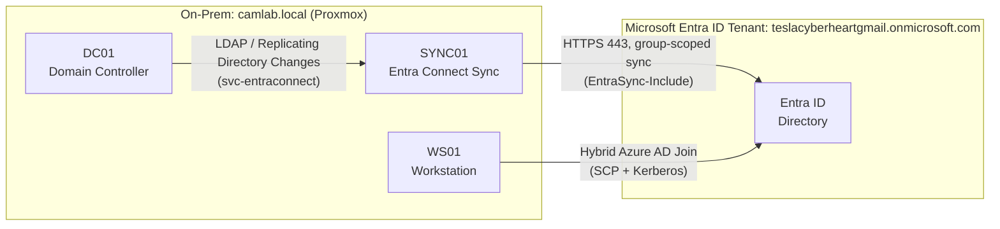

# Hybrid Identity Extension: On-Prem AD → Microsoft Entra ID

This extends `ad-lab-iac` beyond on-prem hardening into hybrid identity —
syncing `camlab.local` to Microsoft Entra ID via Microsoft Entra Connect
Sync, and hybrid-joining a workstation (WS01) so Conditional Access
(owned in `iac-foundation`) can eventually apply device-based checks.

## Topology



## Design decisions

### Password Hash Synchronization (PHS) over Pass-Through Authentication

Chose PHS because it decouples cloud sign-in availability from on-prem
uptime — this lab runs on a single Proxmox host with no HA, so a PTA
agent going down would mean cloud sign-in fails too. Verified end-to-end:
`cparent-adm` signed into `myaccount.microsoft.com` using their on-prem
AD password, proving the synced hash actually authenticates.

### Group-based sync scoping

Rather than syncing the whole directory, sync is scoped to a single
security group, `EntraSync-Include` (`OU=Groups,DC=camlab,DC=local`).
Only members of that group sync to Entra ID — both users and computer
objects. This was configured directly in the Entra Connect Sync wizard's
"Filter users and devices" step, bound to the group.

### Delegated connector account, not Domain Admin

`svc-entraconnect` (`OU=ServiceAccounts,DC=camlab,DC=local`) has exactly
two delegated rights at the domain root — `Replicating Directory Changes`
and `Replicating Directory Changes All` — granted via `dsacls`, not
Domain Admin. This is the minimum Entra Connect Sync needs to read
directory objects and password hashes for PHS.

## What's automated vs. manual

| Task | How |
|---|---|
| UPN suffix alignment on the domain forest | ✅ Automated — `entra_connect_prereqs` role |
| `EntraSync-Include` scoping group + `Groups` OU | ✅ Automated — `entra_connect_prereqs` role |
| `ServiceAccounts` OU + `svc-entraconnect` account | ✅ Automated — `entra_connect_prereqs` role |
| Delegated replication permissions (`dsacls`) | ✅ Automated, idempotency-checked before granting |
| TLS 1.2 + outbound HTTPS firewall on SYNC01 | ✅ Automated — `entra_connect_host_hardening` role |
| Entra Connect Sync install + wizard configuration | ⚠️ Manual — no supported unattended install exists (confirmed via Microsoft's own Entra Connect FAQ) |
| SCP creation for Hybrid Azure AD Join | ⚠️ Manual — run via the Entra Connect wizard's "Configure device options" task, requires Enterprise Admin rights |
| Initial + delta sync validation | ⚠️ Manual — `Start-ADSyncSyncCycle`, verified in Entra admin center |
| Hybrid join verification | ⚠️ Manual — `dsregcmd /status` on WS01 |

## Issues encountered and root causes

**Wrong UPN suffix assumed initially.** Assumed the tenant's default
domain would be `teslacyberheart.onmicrosoft.com` based on the sign-in
email `teslacyberheart@gmail.com`. The tenant's actual default domain
was `teslacyberheartgmail.onmicrosoft.com` — Microsoft's auto-generated
tenant name doesn't always match the intuitive prefix. Caught this when
user creation in the admin center showed the real domain in the
UPN suffix dropdown. Fix: removed the wrong suffix and added the correct
one via `Set-ADForest -UPNSuffixes`, then updated the Ansible role default
to match.

**Personal Microsoft account rejected by Entra Connect Sync.**
`teslacyberheart@gmail.com` (a live.com-backed MSA) has Global
Administrator rights in the tenant via the admin center, but Entra
Connect Sync's sign-in step rejected it outright
(`AADSTS50020: User account does not exist in tenant`). Consumer/MSA
identities aren't native tenant objects even when granted admin roles.
Fix: created a dedicated cloud-native admin account
(`svc-connectadmin@teslacyberheartgmail.onmicrosoft.com`) specifically
for this purpose — the correct pattern regardless, since dedicated
service/admin accounts shouldn't be personal logins.

**Hybrid join failed with `error_missing_device` on first attempt.**
`dsregcmd /debug /join` returned "The device object by the given id...
is not found" after WS01's computer object was added to
`EntraSync-Include`. Root cause: no sync cycle had run since the group
membership change, so Entra ID had no device object yet for WS01 to
register against. Fix: triggered `Start-ADSyncSyncCycle -PolicyType Delta`
on SYNC01, confirmed WS01 appeared under Devices in the admin center,
then retried the join successfully.

**Cloud Kerberos trust join attempt failed (expected, not an error).**
Join logs show a `DEVICE_AUTO_KERB` attempt failing against SPN
`adrs/enterpriseregistration.windows.net` before falling back to the
standard `DEVICE_AUTO` sync-join method, which succeeded. This is
expected behavior for a PHS-only setup without additional Cloud Kerberos
trust configuration — the fallback is by design, not a fault.

**Privileged account in sync scope caused a persistent export failure.**
`cparent-adm` (member of Domain Admins and Enterprise Admins) was
initially included in `EntraSync-Include` for sync validation testing.
Every export cycle against `camlab.local` returned
`completed-export-errors` with error code 8344
("Insufficient access rights to perform the operation") against this
object specifically, with a retry count climbing across multiple full
and delta cycles. Root cause was two-layered:

1. AD's AdminSDHolder/SDProp process runs hourly and forcibly overwrites
   the ACL on any object flagged as protected (`AdminCount: 1`),
   disabling permission inheritance from the domain root. This silently
   stripped the inherited `dsacls` grant given to `svc-entraconnect`,
   confirmed via `dsacls "CN=Cameron Parent (Admin),..."` returning no
   entries for the account at all, despite the grant existing correctly
   at the domain root.
2. The specific write being attempted was a `ms-DS-ConsistencyGuid`
   stamp — the sourceAnchor Entra Connect Sync writes back to an AD
   object on its first sync. `svc-entraconnect` was deliberately granted
   only the two read-side replication rights (`Replicating Directory
   Changes`, `Replicating Directory Changes All`) with no write access,
   so this write was always going to fail for this object — and, given
   (1), no domain-root grant could have reached it regardless.

Fix: removed `cparent-adm` from `EntraSync-Include` — the correct
resolution architecturally, not just a permissions workaround, since
break-glass/privileged accounts shouldn't sync to the cloud in the first
place. The already-queued pending export for the object didn't clear on
its own even after a full sync cycle (`Start-ADSyncSyncCycle -PolicyType
Initial`), and GUI deletion via **Search Connector Space** was
unavailable for this object state in the installed Entra Connect Sync
version (no `Delete` option on right-click). Cleared it with the
supported cmdlet instead (available since Entra Connect Sync 1.5.18.0):

```powershell
Import-Module "C:\Program Files\Microsoft Azure AD Sync\Bin\ADSync\ADSync.psd1"
$csObj = Get-ADSyncCSObject -ConnectorName "camlab.local" `
  -DistinguishedName "CN=Cameron Parent (Admin),CN=Users,DC=camlab,DC=local"
Remove-ADSyncCSObject -ConnectorName "camlab.local" `
  -DistinguishedName $csObj.DistinguishedName
```

Confirmed clean via a subsequent delta sync (`success`, 0 errors) and
verified WS01 as **Microsoft Entra hybrid joined** in the Entra ID
admin center — the correct end state this troubleshooting was
validating in the first place.

## Running it

```bash
ansible-playbook -i inventory/hosts.yml playbooks/hybrid-identity.yml --ask-pass
```

Then complete the manual steps above in order: Entra Connect Sync
install/config wizard, initial sync validation, SCP configuration for
hybrid join, and per-device join verification.
